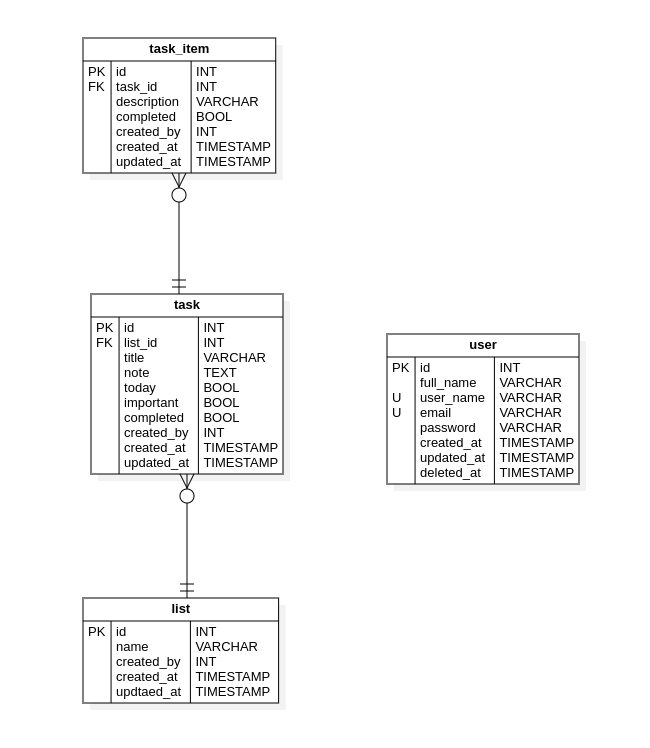

# CodeIgniter4 - Api REST - Todo List
---

<a name="contenido"></a>
## Contenido
* [Introducción](#introduccion)
* [Requerimientos](#requerimientos)
* [Descarga de repositorio](#repositorio)
* [Configuración de proyecto](#proyecto)
	* [Instalación de dependencias utilizando Composer](#composer)
	* [Exportar script sql a MySql](#mysql)
	* [Configuración de proyecto](#configuracion)
* [Crear servidor php](#servidor)


<a name="introduccion"></a>
## Introducción

Ejemplo de una Api-REST de lista de tareas utilizando el Framework php **CodeIgniter 4** con MySQL y Firebase/Jwt.

[Contenido](#contenido)

<a name="requerimientos"></a>
## Requerimiento
* Php 7.4 o superior
* Composer
* Mysql
* CodeIgniter [Página Oficial](https://codeigniter.com/user_guide/intro/index.html)

[Contenido](#contenido)

<a name="repositorio"></a>
## Descarga de repositorio
Primero clonamos el proyecto
```bash
# SSH
git clone git@github.com:igmr/CodeIgniter4-Api-REST-TodoList.git
```
O

```bash
# HTTPS
git clone https://github.com/igmr/CodeIgniter4-Api-REST-TodoList.git
```

Accedemos al proyecto
```bash
cd CodeIgniter4-Api-REST-TodoList
```
[Contenido](#contenido)

<a name="proyecto"></a>
## Configuración de proyecto

<a name="composer"></a>
### Instalación de dependencias utilizando Composer

Ejecutar la siguiente instrucción para descargar las dependencias necesarias por medio de composer.

```bash
composer update
```
[Contenido](#contenido)

<a name="mysql"></a>
### Exportar script sql a MySql
#### Modelo entidad relacion

#### Importar y exportar script SQL
Para importar script sql al gestor de base de datos MySql, lo podemos realizar mediante PhpMyAdmin, workbench o desde la linea de comando. El siguiente comando importa el script sql a MySql desde la linea de comandos

```bash
# Sintaxis
mysql -u <user_name> -p<password> < <path/script/sql>

# O
mysql -u <user_name> -p < <path/script/sql>

# Ejemplo
mysql -u root -p < ./doc/script.sql
```
Para realizar la operación inversa usaremos el siguiente comando
```bash
# Sintaxis
mysqldump -u <user_name> -p<password> <database> > <path/script/sql>

# O
mysqldump -u <user_name> -p <database> > <path/script/sql>

# Ejemplo
mysqldump -u root -p CodeIgniter4_Api_REST_Todo_List > ./script.sql
```

[Ír a Script SQL] (#scriptsql)


[Contenido](#contenido)

<a name="configuracion"></a>
## Configuración de proyecto

Abrimos el proyecto en nuestro editor de código de preferencia
```bash
# Accedemos al proyecto
cd CodeIgniter4-Api-REST-TodoList
# Abrimos el proyecto con Visual Studio Code
code .
# O también podemos abrirlo con sublime text
subl .
```

Duplicamos archivo `env` y lo renombramos `.env`

```bash
#CI_ENVIRONMENT = production
...
# app.baseURL = '' # Colocar la ruta base
...
# Descomentamos estas lineas y colocamos nuestras credenciales de MySQL
# database.default.hostname = localhost
# database.default.database = ci4
# database.default.username = root
# database.default.password = root
# database.default.DBDriver = MySQLi
# database.default.DBPrefix =
# database.default.port = 3306
...

```


<a name="servidor"></a>
### Consola

Después de configurar el archivo `.env`, crearemos la base de datos desde spark, para ello abriremos una terminal, ubicamos dentro del proyecto de CodeIgniter e ingresamos el siguiente comando

```bash
# Sintaxis
php spark db:create <DataBaseName>
# Ejemplo
php spark db:create CodeIgniter4_Api_REST_Todo_List
```

Después crearemos las migraciones.

```bash
# Ejecutar migraciones
php spark migrate
```

Y finalmente levantamos el servidor desde Spark
```bash
php spark serve
```

## Script Sql

<a name="scriptsql"></a>

```sql

DROP DATABASE IF EXISTS CodeIgniter4_Api_REST_Todo_List;
CREATE DATABASE IF NOT EXISTS CodeIgniter4_Api_REST_Todo_List;
USE CodeIgniter4_Api_REST_Todo_List;

DROP TABLE IF EXISTS list;
CREATE TABLE list(
	id			INT(15)			NOT	NULL	AUTO_INCREMENT,
	name		VARCHAR(128)	NOT	NULL	DEFAULT	'',
	created_by	INT(15)	NOT		NULL		DEFAULT	0,
	created_at	TIMESTAMP		NOT	NULL	DEFAULT	current_timestamp(),
	updated_at	TIMESTAMP			NULL	DEFAULT	NULL,
	PRIMARY KEY	(id),
	UNIQUE KEY	id(id),
	UNIQUE KEY	name(name)
) ENGINE=InnoDB DEFAULT CHARSET=utf8mb3 COLLATE=utf8mb3_general_ci;

INSERT INTO list(name) VALUES('(predeterminado)'); 

DROP TABLE IF EXISTS task;
CREATE TABLE task(
	id			INT(15)		NOT	NULL	AUTO_INCREMENT,
	list_id		INT(15)		NOT	NULL	DEFAULT	1,
	tittle		VARCHAR(65)	NOT	NULL	DEFAULT	'',
	note		TEXT		NOT	NULL,
	today		tinyINT(1)	NOT	NULL	DEFAULT	0,
	important	tinyINT(1)	NOT	NULL	DEFAULT	0,
	completed	tinyINT(1)	NOT	NULL	DEFAULT	0,
	created_by	INT(15)		NOT	NULL	DEFAULT	1,
	created_at	TIMESTAMP	NOT	NULL	DEFAULT	current_timestamp(),
	updated_at	TIMESTAMP		NULL	DEFAULT	NULL,
	PRIMARY KEY (id),
	UNIQUE KEY id(id),
	CONSTRAINT task_list_id_foreign FOREIGN KEY(list_id) REFERENCES list(id)
) ENGINE=InnoDB DEFAULT CHARSET=utf8mb3 COLLATE=utf8mb3_general_ci;

INSERT INTO task(list_id,tittle,note,important,completed)
VALUES(1 ,'(predeterminado)','(predeterminado)', false, false); 


DROP TABLE IF EXISTS task_item;
CREATE TABLE task_item	(
	id			INT(15)		NOT	NULL	AUTO_INCREMENT,
	task_id		INT(15)		NOT	NULL	DEFAULT	1,
	description	TEXT		NOT	NULL,
	completed	tinyINT(1)	NOT	NULL	DEFAULT	0,
	created_by	INT(15)		NOT	NULL	DEFAULT	1,
	created_at	TIMESTAMP	NOT	NULL	DEFAULT	current_timestamp(),
	updated_by	TIMESTAMP		NULL	DEFAULT	NULL,
	PRIMARY KEY (id),
	UNIQUE KEY id (id),
	CONSTRAINT task_item_task_id_foreign FOREIGN KEY (task_id) REFERENCES task(id)
) ENGINE=InnoDB DEFAULT CHARSET=utf8mb3 COLLATE=utf8mb3_general_ci;

DROP TABLE IF EXISTS user;
CREATE TABLE user(
	id			INT(15)			NOT	NULL	AUTO_INCREMENT,
	full_name	VARCHAR(65)		NOT	NULL	DEFAULT	'',
	user_name	VARCHAR(65)		NOT	NULL	DEFAULT	'',
	email		VARCHAR(65)		NOT	NULL	DEFAULT	'',
	password	VARCHAR(512)	NOT	NULL	DEFAULT	'',
	created_at	TIMESTAMP		NOT	NULL	DEFAULT	current_timestamp(),
	updated_at	TIMESTAMP			NULL	DEFAULT	NULL,
	deleted_at	TIMESTAMP			NULL	DEFAULT	NULL,
	PRIMARY KEY (id),
	UNIQUE KEY id(id),
	UNIQUE KEY user_name(user_name),
	UNIQUE KEY email(email)
) ENGINE=InnoDB DEFAULT CHARSET=utf8mb3 COLLATE=utf8mb3_general_ci;

```


